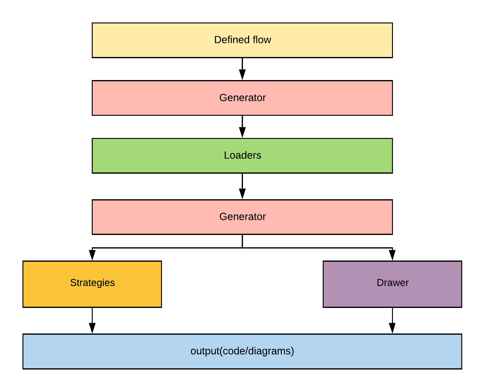

## High level architecture

Effe contains from the following components:

1. Generator

   This component is responsible for connecting and run all components.

1. Loaders

    When Generator finds a function which contains another function -  `BuildFlow`  it's a trigger to run Loader for package `loaders` and converts Golang Ast to a tree of components.

1. Strategies

    This component converts a tree of components to Golang code.

1. Drawer

    This component convers a tree of components to diagrams.
