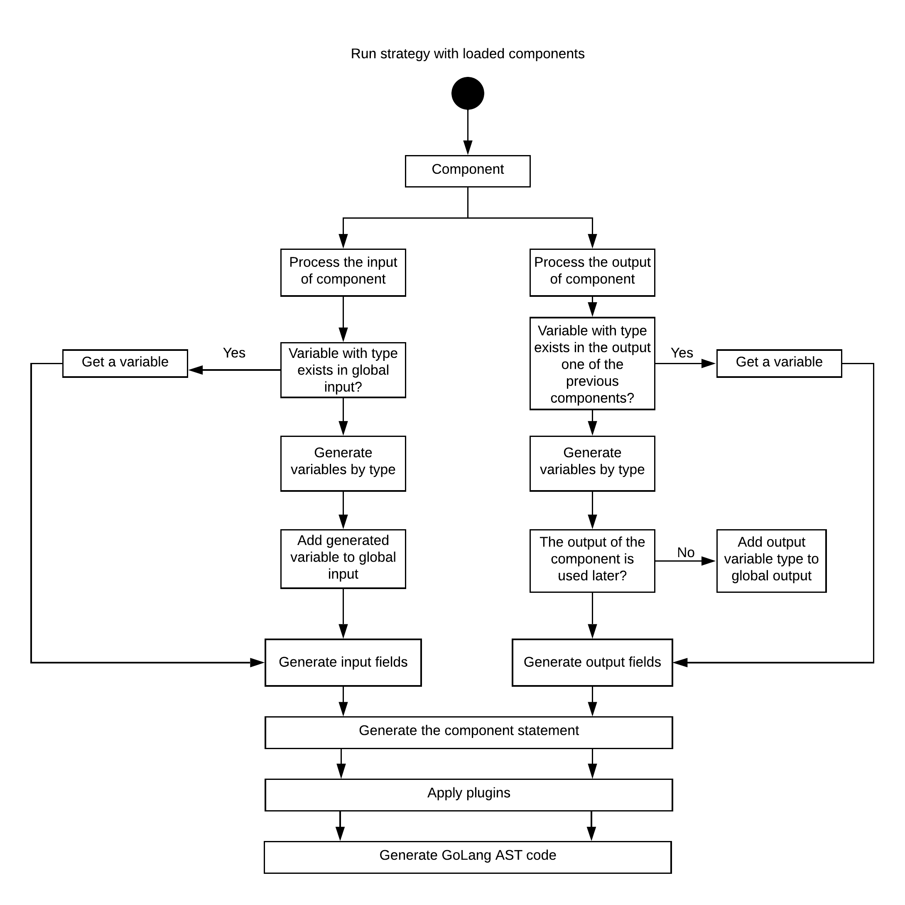

## Chain strategy


It's the default stratagy for Effe. This strategy converts a tree of components to a sequence of calling functions one by one.

Example:

```golang
 effe.BuildFlow(
    effe.Step(step1),
    effe.Step(step2),
    effe.Step(step3),
    effe.Step(step4),
 )
```

Result:

```golang
    return func() (b, error) {
        val1, err := service.Step1()
        if err != nil {
            return nil, err
        }
        val2 := err = service.Step2(val1)
        if err != nil {
            return nil, err
        }
        return nil
        val3, err := service.Step3(val2)
        if err != nil {
            return nil, err
        }
        val4, err = service.Step4(val3)
        if err != nil {
            return nil, err
        }
        return val4, nil
    }
```
